# 莱钢集团 AI 文档比对系统解决方案

**文档版本：** V1.1  
**编制日期：** 2026年3月25日  
**版本说明：** V1.1 根据项目负责人审查意见调整——一期采用公共AI模型API替代自建GPU服务器，压缩软件开发成本；GPU服务器建设移至二期综合规划。  
**项目负责人：** （待填写）  
**预计完成时间：** 2026年5月31日

---

## 目录

1. [项目背景](#一项目背景)
2. [目标与范围](#二目标与范围)
3. [技术架构](#三技术架构)
4. [主要功能](#四主要功能)
5. [系统流程](#五系统流程)
6. [项目工期安排](#六项目工期安排)
7. [取得的效果](#七取得的效果)
8. [实现难度评定](#八实现难度评定)
9. [风险评估](#九风险评估)
10. [投资收益分析](#十投资收益分析)
11. [团队与资源](#十一团队与资源)
12. [验收标准](#十二验收标准)

---

## 一、项目背景

### 1.1 企业现状

莱钢集团作为国内大型钢铁联合企业，业务涵盖炼铁、炼钢、轧材、能源、物流等多个板块，日常运营中涉及大量业务文档，包括但不限于：

- **合同类文档**：采购合同、销售合同、服务协议、框架协议等
- **技术类文档**：工艺规程、技术标准、操作规范、检验报告等
- **管理类文档**：制度文件、流程规范、会议纪要、审批文件等
- **报表类文档**：生产报表、质量报告、财务报表、安全记录等

上述文档数量庞大、版本复杂，各部门在文档流转、修订、审批过程中频繁需要进行版本比对、内容核查，传统人工比对方式存在明显瓶颈。

### 1.2 痛点分析

| 痛点类型 | 具体问题 | 影响程度 |
|---------|---------|---------|
| 效率低下 | 人工逐行核对，单份合同比对需耗时2-4小时 | 高 |
| 错误率高 | 人眼疲劳导致漏检，关键条款遗漏风险大 | 高 |
| 格式多样 | Word、PDF、Excel等格式混杂，缺乏统一比对工具 | 中 |
| 版本混乱 | 多版本并存，难以快速定位有效差异 | 高 |
| 审核周期长 | 文档审核平均周期3-5天，影响业务推进 | 中 |
| 知识积累难 | 比对经验依赖个人，缺乏系统化沉淀 | 低 |

### 1.3 项目背景

依托莱钢集团数字化转型战略，以AI技术赋能文档管理为核心切入点，建设智能文档比对系统，解决上述业务痛点，提升文档处理效率与准确性，为集团精益管理奠定数字基础。

---

## 二、目标与范围

### 2.1 建设目标

- **效率目标**：文档比对效率提升 **80%以上**，将平均比对时间由小时级压缩至分钟级
- **准确性目标**：差异识别准确率达到 **98%以上**，消除人工漏检风险
- **覆盖目标**：支持集团主要业务文档类型，覆盖 **90%** 以上常用格式
- **体验目标**：操作简便，业务人员无需技术背景即可独立使用

### 2.2 项目范围

**一期范围（本方案）：**

- 合同类文档智能比对
- 技术规程文档比对
- 管理制度文档版本对比
- 支持格式：Word（.docx/.doc）、PDF、纯文本（.txt）

**二期扩展（规划）：**

- Excel报表数据级比对
- 图纸/附件比对
- 多文档批量比对流水线
- **AI基础设施升级**：综合评估与其他项目共建GPU服务器，或接入集团共享GPU资源，实现大模型私有化部署，彻底消除数据外传风险

---

## 三、技术架构

### 3.1 总体架构图

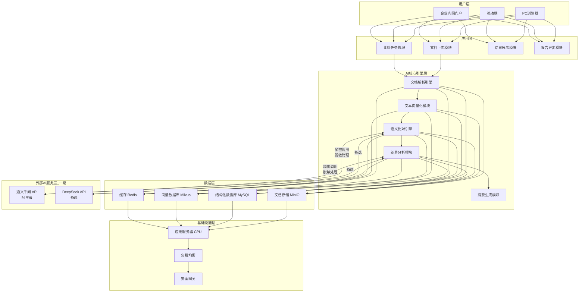

> **一期说明：** 语义比对核心能力通过调用公共大模型API（通义千问/DeepSeek等）实现，文档内容在调用前进行脱敏处理，传输全程加密。二期将根据集团资源统筹情况，评估与其他项目共建GPU服务器或接入集团共享算力，实现大模型完全私有化部署。

### 3.2 技术选型

| 层次 | 技术组件 | 选型说明 |
|------|---------|---------|
| 前端 | Vue3 + Element Plus | 成熟生态，开发效率高 |
| 后端 | Python FastAPI | 异步高性能，AI集成友好 |
| 文档解析 | Apache Tika + pdfplumber + python-docx | 多格式统一解析 |
| 大语言模型（一期） | 通义千问API / DeepSeek API | 调用公共模型服务，无需自建GPU，按量计费；调用前执行内容脱敏 |
| 大语言模型（二期） | 私有化部署LLM（待定） | 与集团GPU资源规划联动，实现数据不出厂 |
| 向量模型 | BGE-M3（本地轻量化部署） | CPU可运行，中文语义理解优秀，无需GPU |
| 向量数据库 | Milvus | 高性能相似度检索 |
| 文件存储 | MinIO | 私有化对象存储 |
| 关系型数据库 | MySQL 8.0 | 任务、用户、日志管理 |
| 缓存 | Redis | 会话及热点数据缓存 |
| 容器化 | Docker + Docker Compose | 轻量部署，一期无需K8s |

### 3.3 AI模型架构

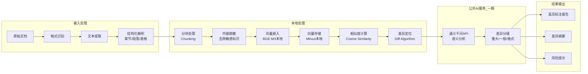

> **设计原则：** 字符级比对与向量计算全部在本地完成，仅将脱敏后的差异片段发送至公共LLM API进行语义理解分析，最大限度减少外传数据量，降低数据安全风险。

---

## 四、主要功能

### 4.1 功能清单

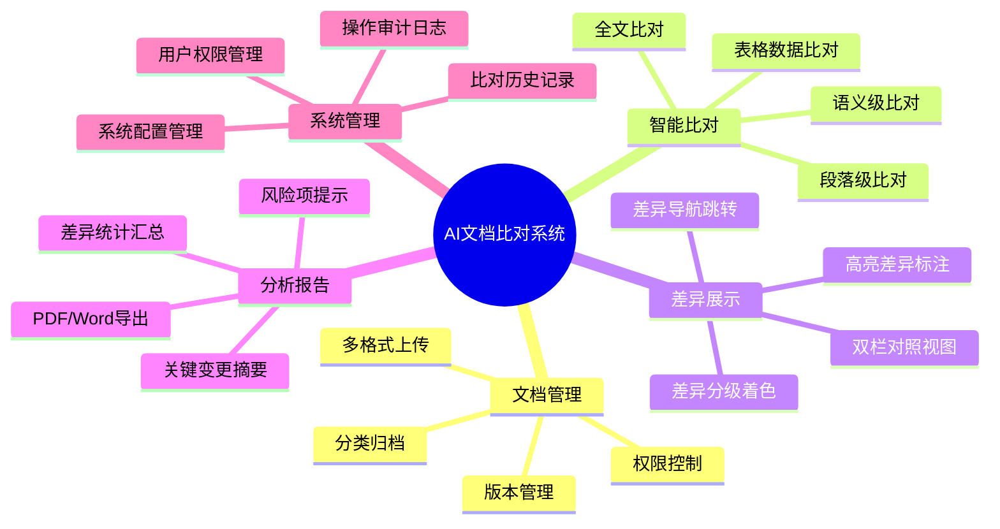

### 4.2 核心功能详述

#### 4.2.1 多格式智能解析

- 支持 `.docx`、`.doc`、`.pdf`、`.txt` 等主流格式
- 自动识别文档结构（标题层级、段落、表格、附件）
- 支持扫描版PDF的OCR文字识别
- 单文件支持最大 **200MB**，最长 **500页**

#### 4.2.2 三层比对能力

| 比对层级 | 说明 | 应用场景 |
|---------|------|---------|
| 字符级比对 | 精确到每个字符的增删改 | 合同条款精确核查 |
| 段落级比对 | 段落内容相似度与位移检测 | 文档结构变化分析 |
| 语义级比对 | 基于LLM理解意思是否等价 | 改述条款风险识别 |

#### 4.2.3 差异可视化展示

- **双栏对照模式**：左右文档同步滚动，差异高亮显示
- **差异颜色体系**：
  - 🔴 红色：删除内容
  - 🟢 绿色：新增内容
  - 🟡 黄色：修改内容
  - 🔵 蓝色：移动/重排内容
- **差异导航**：通过导航栏快速跳转至各差异点

#### 4.2.4 智能风险提示

- 自动识别合同金额、日期、违约条款等关键字段变化
- 对重大变更生成风险等级标注（高/中/低）
- 提供变更摘要说明，支持一键生成审核意见

#### 4.2.5 比对报告导出

- 支持导出为 Word / PDF 格式的差异报告
- 报告包含：变更摘要、差异明细列表、风险提示项
- 支持自定义报告模板，符合集团文件格式规范

---

## 五、系统流程

### 5.1 业务使用流程

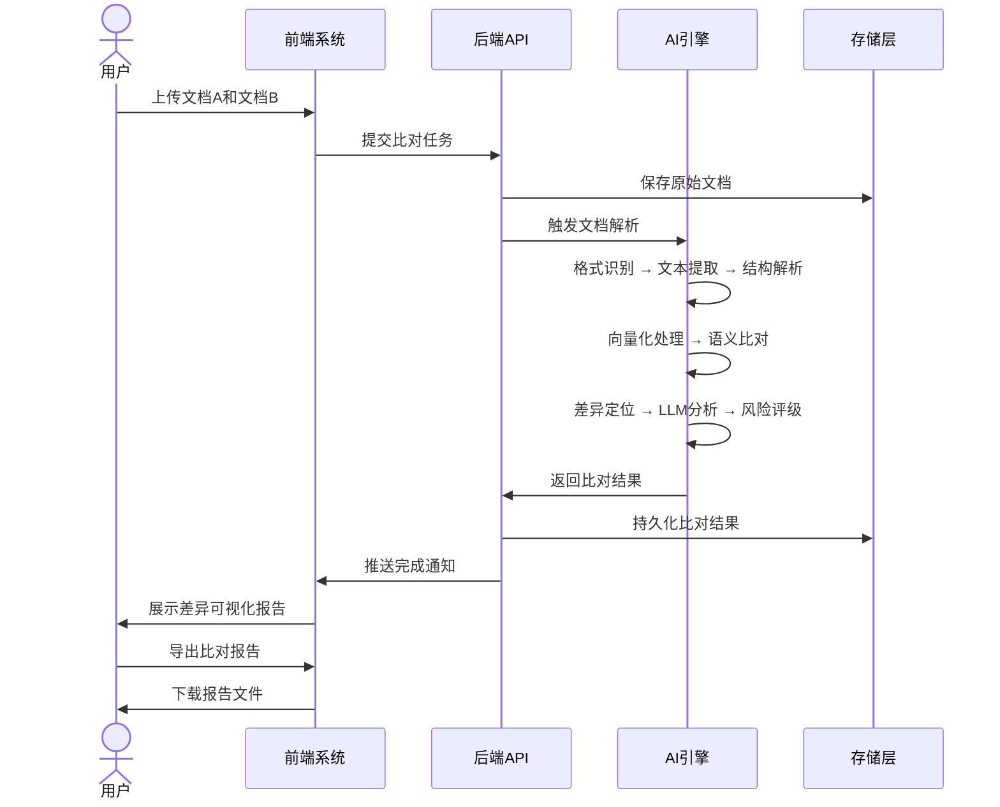

### 5.2 数据处理流程

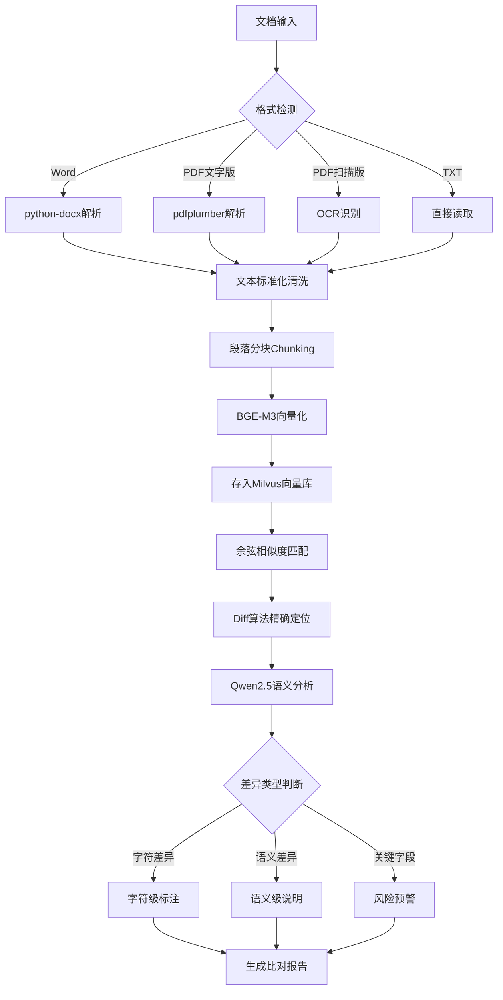

---

## 六、项目工期安排

### 6.1 里程碑计划

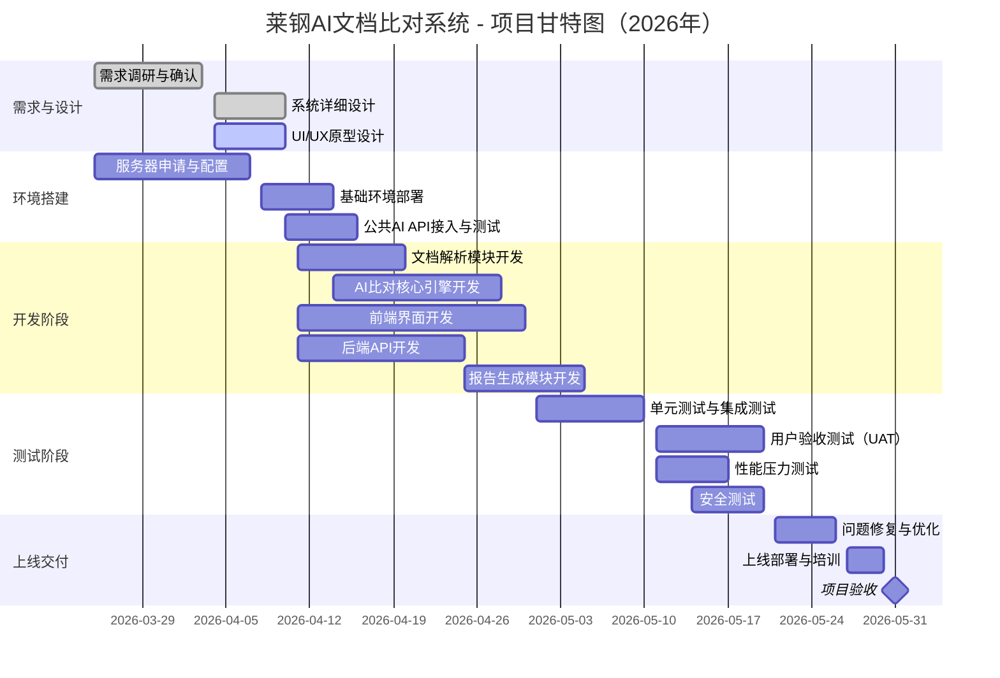

### 6.2 各阶段交付物

| 阶段 | 时间 | 主要交付物 |
|------|------|----------|
| 需求设计阶段 | 3月25日 – 4月10日 | 需求规格说明书、系统设计文档、UI原型 |
| 环境搭建阶段 | 3月25日 – 4月18日 | 开发/测试/生产环境就绪，AI模型部署完成 |
| 开发阶段 | 4月11日 – 5月5日 | 各功能模块代码，接口联调完成 |
| 测试阶段 | 5月1日 – 5月20日 | 测试报告、性能报告、安全检测报告 |
| 上线交付阶段 | 5月21日 – 5月31日 | 上线系统、操作手册、培训材料、验收报告 |

---

## 七、取得的效果

### 7.1 效率提升

| 业务场景 | 改造前 | 改造后 | 提升幅度 |
|---------|-------|-------|---------|
| 合同比对（10页以内） | 约60分钟 | 约3分钟 | **95%↑** |
| 合同比对（50页以内） | 约4小时 | 约8分钟 | **97%↑** |
| 技术规程比对 | 约2小时 | 约5分钟 | **96%↑** |
| 制度文件版本比对 | 约1.5小时 | 约4分钟 | **96%↑** |
| 文档审核周期 | 3-5天 | 0.5-1天 | **75%↓** |

### 7.2 准确性提升

- 字符级差异识别准确率：**≥99.5%**
- 语义级差异识别准确率：**≥98%**
- 关键字段（金额/日期）变化捕获率：**100%**
- 误报率（正常内容误标为差异）：**＜0.5%**

### 7.3 管理效益

- 建立文档比对历史档案，实现版本可追溯
- 减少因文档差异疏漏引起的合同纠纷风险
- 标准化审核流程，降低对个人经验的依赖
- 为后续合同智能审核、条款知识库建设奠定基础

---

## 八、实现难度评定

### 8.1 总体难度评级：★★★☆☆（中等）

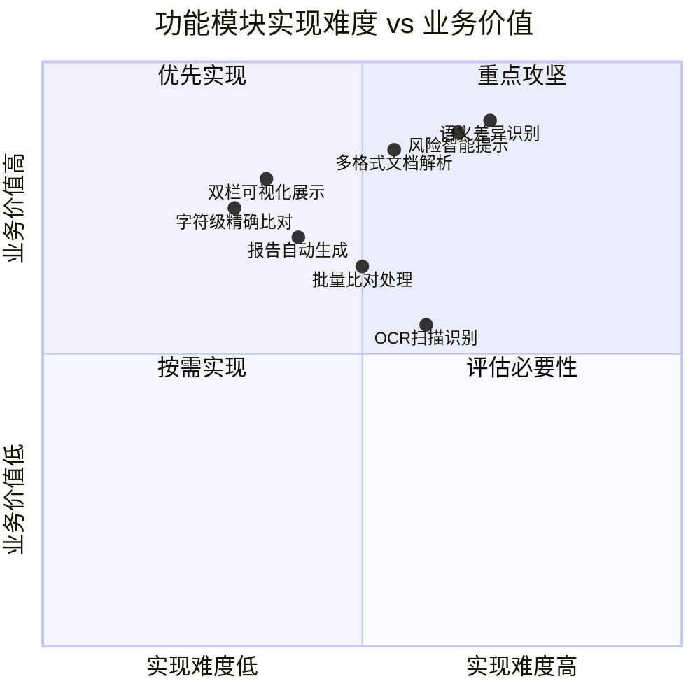

### 8.2 各模块难度分析

| 模块 | 难度 | 难点说明 | 应对措施 |
|------|-----|---------|---------|
| 文档解析 | ★★★☆☆ | 钢铁行业特殊格式文档解析，扫描版PDF质量参差不齐 | 采用多引擎组合，针对常见文档格式定制解析规则 |
| AI语义比对 | ★★★★☆ | 钢铁专业术语的语义理解，行业特定表达方式 | 对LLM进行行业领域微调或构建专业提示词体系 |
| 差异可视化 | ★★☆☆☆ | 长文档渲染性能，复杂表格的差异对齐展示 | 前端虚拟滚动优化，表格差异特殊处理逻辑 |
| 风险识别 | ★★★☆☆ | 业务规则的抽象与模型化，关键字段定义灵活 | 与业务部门深度协作，建立风险规则知识库 |
| 系统集成 | ★★☆☆☆ | 与集团现有OA/ERP系统对接 | 预留标准API接口，按需集成 |

---

## 九、风险评估

### 9.1 风险矩阵

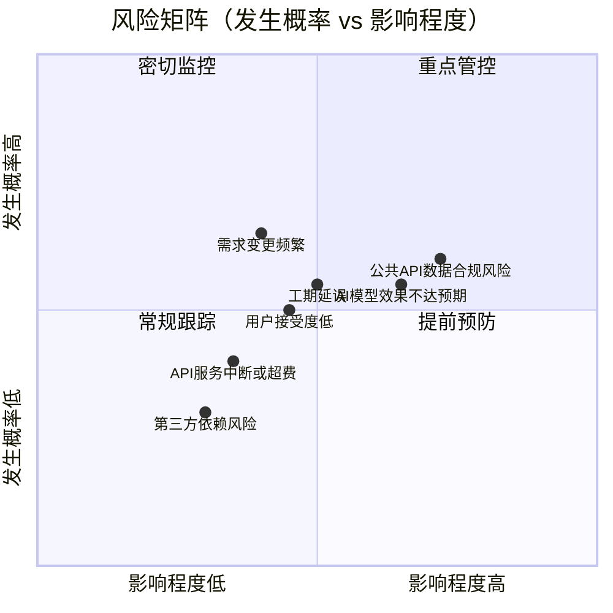

### 9.2 风险清单与应对

| 风险编号 | 风险描述 | 发生概率 | 影响程度 | 风险等级 | 应对措施 |
|---------|---------|---------|---------|---------|---------|
| R01 | AI语义比对效果不达预期，尤其是钢铁行业专业术语 | 中 | 高 | 🔴 高 | 提前收集行业语料进行测试；建立人工审核兜底机制；设置分阶段验收指标 |
| R02 | 公共AI API调用存在数据外传合规风险 | 中 | 高 | 🔴 高 | 调用前强制内容脱敏（去除公司名、合同编号等敏感字段）；选择签订数据保密协议的合规API服务商；敏感文档类型明确标注不发送至外部API；二期完成私有化部署后彻底消除此风险 |
| R03 | 工期延误（API接入或功能联调周期不可控） | 中 | 中 | 🟡 中 | 关键路径重点管控；提前完成API接入测试；核心功能优先交付 |
| R04 | 用户使用习惯转变困难，推广阻力 | 中 | 中 | 🟡 中 | 分批次试点推广；提供专项培训；收集反馈快速迭代优化 |
| R05 | 扫描版PDF识别精度不足 | 中 | 低 | 🟢 低 | 明确一期不强制支持低质量扫描件；提供文档质量说明文档 |
| R06 | 公共AI API服务中断或费用超预算 | 低 | 中 | 🟢 低 | 同时接入2家备选API服务商（主用通义千问，备用DeepSeek）；设置月度API费用预警阈值 |
| R07 | 与现有系统集成接口不兼容 | 低 | 低 | 🟢 低 | 一期作为独立系统上线，二期再规划集成 |

---

## 十、投资收益分析

### 10.1 投资成本估算

#### 10.1.1 硬件成本（一次性）

> 一期采用公共AI模型API，无需采购GPU服务器，硬件投入大幅压缩。

| 设备类型 | 规格 | 数量 | 单价（万元） | 合计（万元） |
|---------|------|------|------------|------------|
| ~~GPU服务器~~ | ~~4×A100 80GB，512GB内存~~ | ~~1台~~ | ~~80~~ | ~~80（移至二期）~~ |
| 应用服务器 | 16核CPU，64GB内存，2TB存储 | 1台 | 5 | 5 |
| 存储服务器 | NAS，50TB可用容量 | 1台 | 6 | 6 |
| 网络设备 | 千兆交换机 | 1套 | 1 | 1 |
| **小计** | | | | **12** |

#### 10.1.2 软件与开发成本

> 一期以精简团队为原则，采用全栈+AI工程师组合，压缩外包及人力成本。

| 费用类型 | 说明 | 金额（万元） |
|---------|------|------------|
| 开发人力成本 | 3人×2个月（AI+全栈工程师×2，测试兼任） | 24 |
| 公共AI API调用费（测试期） | 通义千问/DeepSeek API，按Token计费，测试阶段预估 | 1 |
| 开源组件部署 | BGE-M3、Milvus、MinIO等全部开源免费 | 0 |
| 第三方组件授权 | OCR引擎等商业组件 | 3 |
| **小计** | | **28** |

#### 10.1.3 运营维护成本（年度）

| 费用类型 | 金额（万元/年） |
|---------|--------------|
| 系统运维人力（兼职） | 5 |
| 服务器电力及机房成本 | 2 |
| 公共AI API调用费（正式运行）| 3 |
| 持续迭代开发 | 8 |
| **年度合计** | **18** |

#### 10.1.4 总投资汇总

| 阶段 | V1.0方案（万元） | V1.1调整后（万元） | 节省（万元） |
|------|--------------|----------------|-----------|
| 一次性建设投入 | 154 | **40** | **114** |
| 第1年运营成本 | 33 | **18** | **15** |
| **第1年总成本** | **187** | **58** | **129** |

> GPU服务器建设费用（约80-100万元）将在二期与其他项目统筹规划，避免重复建设，实现资源最大化利用。

### 10.2 收益测算

#### 10.2.1 直接人工成本节约

**假设基础：**
- 涉及文档比对工作的岗位约 **50人**
- 每人每周平均文档比对时间 **4小时**
- 年工作周 **48周**，平均人力成本 **15万元/年·人**

| 项目 | 数值 |
|------|------|
| 年度人工比对总工时 | 50人 × 4小时/周 × 48周 = **9,600小时** |
| AI系统后节约比例 | **85%** |
| 年节约工时 | **8,160小时** |
| 折算人力成本节约 | 8,160 ÷ 2,000 × 15万元 ≈ **61万元/年** |

#### 10.2.2 质量风险损失规避

- 历史因文档比对疏漏引发的合同纠纷，预估年均损失 **20-50万元**
- AI比对关键字段捕获率100%，预估可规避损失 **30万元/年**

#### 10.2.3 流程提速带来的隐性收益

- 合同审核周期缩短，加速业务推进，保守估算创造间接价值 **20万元/年**

#### 10.2.4 收益汇总

| 收益类型 | 年均收益（万元） |
|---------|--------------|
| 人力成本节约 | 61 |
| 风险损失规避 | 30 |
| 业务加速隐性收益 | 20 |
| **年度合计收益** | **111** |

### 10.3 ROI分析

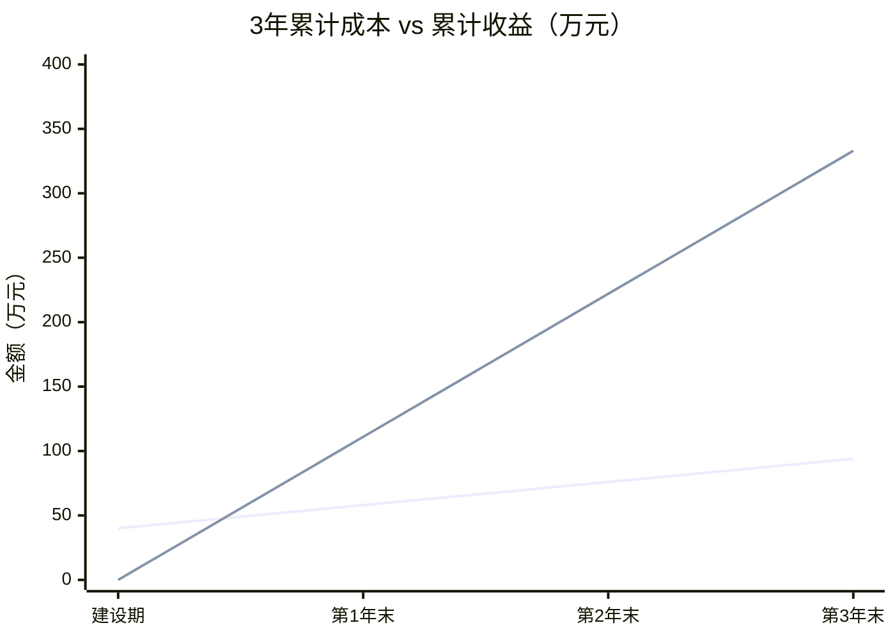

| 年份 | 累计成本（万元） | 累计收益（万元） | 净收益（万元） |
|-----|--------------|--------------|-------------|
| 建设期（2026年） | 58 | 111 | **+53**（当年回本） |
| 第2年（2027年） | 76 | 222 | **+146** |
| 第3年（2028年） | 94 | 333 | **+239** |

**调整后投资回收期约为 6个月，当年即实现正收益，3年ROI约 254%，较V1.0方案大幅提升。**

> 注：V1.0方案因GPU服务器投入较大，回本周期约20个月；V1.1一期轻量化方案回本周期压缩至6个月以内，经济性显著改善。

---

## 十一、团队与资源

### 11.1 项目团队

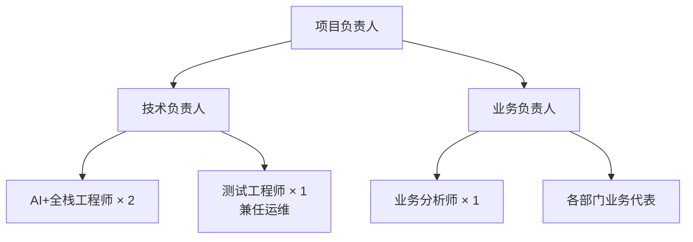

### 11.2 职责分工

| 角色 | 职责 |
|------|------|
| 项目负责人 | 总体统筹、资源协调、进度把控、对外汇报 |
| 技术负责人 | 技术方案设计、架构决策、技术风险管理 |
| AI+全栈工程师（×2） | AI引擎与API集成、前后端开发、文档解析、数据库设计，一人侧重AI+后端，一人侧重前端+集成 |
| 测试工程师（兼运维） | 测试方案设计、功能/性能/安全测试执行，兼任系统日常运维 |
| 业务分析师 | 需求收集与整理、用户验收组织、培训支持 |

---

## 十二、验收标准

### 12.1 功能验收标准

| 验收项 | 验收标准 |
|-------|---------|
| 文档上传 | 支持Word/PDF/TXT格式，单文件≤200MB，上传成功率≥99% |
| 比对准确率 | 字符级≥99.5%，语义级≥98%，经测试文档集验证 |
| 比对速度 | 50页以内文档，比对响应时间≤10分钟 |
| 差异展示 | 双栏对照视图，颜色标注清晰，支持差异导航跳转 |
| 报告导出 | 支持PDF/Word导出，报告格式符合集团规范 |
| 并发支持 | 支持≥10人同时发起比对任务，系统稳定无崩溃 |
| 数据安全 | 文档内容本地存储；调用外部API前执行脱敏处理并有日志记录；通过安全测试 |

### 12.2 验收流程

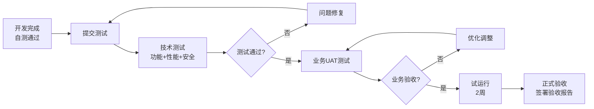

---

## 附录

### A. 术语说明

| 术语 | 说明 |
|------|------|
| LLM | 大语言模型（Large Language Model） |
| RAG | 检索增强生成（Retrieval-Augmented Generation） |
| OCR | 光学字符识别（Optical Character Recognition） |
| BGE | BERT-based General Embedding，中文向量模型 |
| Milvus | 开源向量数据库 |
| UAT | 用户验收测试（User Acceptance Testing） |

### B. 参考文档

- 莱钢集团数字化转型战略规划（2025-2030）
- 集团信息系统安全管理规定
- AI系统数据治理规范

---

*本方案由项目组编制，如需调整请联系项目负责人。*  
*文档版本：V1.1 | 最后更新：2026年3月25日 | 变更：根据审查意见调整AI资源方案及成本结构*
